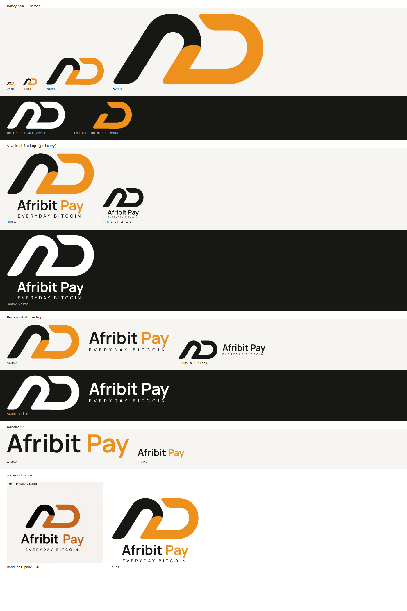

# Afribit Pay — Logo System (Phase 1, v2)

The master vector mark for Afribit Pay, recreated as an **exact vector replica of the
reference** ([actual-ap-LOGO.png](actual-ap-LOGO.png) / the [Mood.png](Mood.png) hero):
one continuous-movement monogram — a black arch handing off into an orange sweep —
reading as a stylized **A→P** ("imaginable P", reads AD at first glance, by design of
the reference).



## How the mark was made

The reference PNG carries an alpha channel isolating the two letterform shapes.
Each color layer (black, orange) was extracted from alpha + color, upscaled 2×,
and vectorized with [vtracer](https://github.com/visioncortex/vtracer) (spline mode).
Fidelity was verified by overlay against the reference — deviation is sub-pixel.
The orange layer is drawn first, black on top, exactly matching the reference's
overlap at the shoulder.

- Icon native geometry: **1346 × 640** viewBox (≈ 2.1 : 1)
- Traced path data lives in [traced_paths.json](traced_paths.json); [generate.py](generate.py) rebuilds every SVG from it

## Color

Sampled from the reference pixels (median of each layer):

| Name | Hex | Use |
|---|---|---|
| Black | `#171713` | Primary — the arch, "Afribit", tagline |
| Orange | `#EE901C` | The sweep + "Pay" |
| White | `#FFFFFF` | Single-color variant for dark backgrounds |

The moodboard palette's deeper copper `#C66B1C` is a one-line swap in `generate.py`
if the brand later prefers it over the reference's brighter orange.

Usage rule: the two-tone mark lives on light backgrounds. On dark, use the all-white
variant (the black arch vanishes on black — see preview). All-black for one-color
print (receipts, thermal stickers).

## Typography

- **Wordmark:** "Afribit Pay" — Manrope **Bold** outlines, slight negative tracking,
  real kerning (shaped with HarfBuzz). Two-tone: "Afribit" black, "Pay" orange.
- **Tagline:** "EVERYDAY BITCOIN." — Manrope **Medium** caps, letterspaced and
  width-justified to the wordmark, exactly like the mood hero.
- All text is converted to paths — no font dependency in any SVG.

## Files

| File | What it is |
|---|---|
| `afribit-monogram[.svg/-black/-white]` | The icon alone (1346 × 640) |
| `afribit-lockup-stacked[…]` | **Primary lockup** — icon over wordmark over tagline (mood hero layout) |
| `afribit-lockup-horizontal[…]` | Icon left, wordmark + tagline right, vertically centered |
| `afribit-wordmark[…]` | Standalone wordmark (fallback / text contexts) |
| `traced_paths.json` | The traced vector data for both layers |
| `generate.py` | Rebuilds the full set (`pip install fonttools uharfbuzz`, Manrope TTFs beside it) |
| `preview.html` / `preview.png` | Contact sheet: sizes, dark/light, vs-mood comparison |
| `actual-ap-LOGO.png`, `Mood.png`, `designplan.md` | Reference assets and the original brief |

Single-color variants add a hairline same-color stroke so the internal seam between
the two traced shapes never shows.

## Regenerating

```
pip install fonttools uharfbuzz
# put Manrope-Bold.ttf and Manrope-Medium.ttf beside generate.py
# (instance from the Manrope variable font, wght 700 / 500 — see fonts.google.com/specimen/Manrope, SIL OFL)
python generate.py
```
